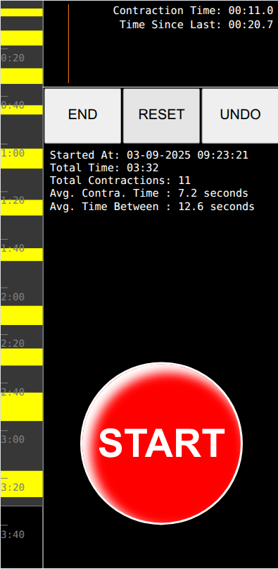
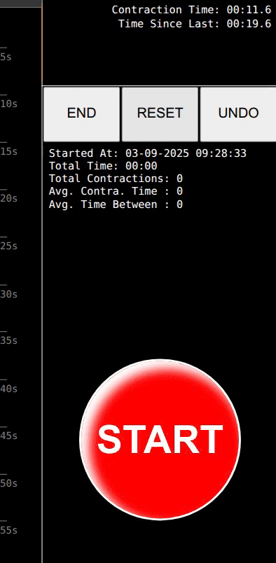

# JB-Timer (Contractions Tracker)

Simple Web app to track pregnancy contractions time. 
 
As a father to be, I wanted to know when my wife was ready to deliver (on the paper). So I made this simple time tracker to count how long and spaced her contractions were in time. This way we would make sure about the right time to head to the hospital.

I can happily say this has been "_tested in production_" very successfully 😊

This is a Vanilla JS app, no dependencies needed, just run it on the browser.

The app is meant to run on a **mobile screen** (I'd never do that on a large screen, the css is not ready).

You can find a running instance on https://jb-timer.netlify.app/

## Features

The idea is that you just push the big red **START** button when a contraction starts, and the **STOP** button when it ends.

The timer tracks the time of every contraction, and when those occur in time.
You can see all the contractions represented as a yellow rectangle on the left vertical bar, along with the time marks. This way you have a very clear image on how constant those are. The "right" signal to run to the hospital is that you have regular ~1 minute contractions every ~2.5 minutes.

### Time tracking

When you load the app it starts running. It saves the data in your localstorage, so if you reload the app and the last tracking was < 5 hours, it will resume from the previous tracking.

You can manually reset the time tracking with the **RESET** button.

### Undo
In case you mark a contraction START but it was actually not real, you can undo it with the **UNDO** button.

### End
Whenever you are done with the tracking, you can stop it with the **END** button.

### Statistics
At the top, you see a horizontal yellow bar representing the current contraction growing in time. 
The orange line marks how long the last contraction lasted, so you have a reference.

The text tells you the elapse time of the current contraction, and the time between the moment the last one ended and the current one started (time between).

Below the 3 buttons you will find general statistics, telling total and averages of the whole tracking.

- **Started At** → The time the tracking started.
- **Total Time** → Total time elapsed of the tracking.
- **Total Contractions** → Total number of contractions recorded.
- **Avg. Contraction Time** → The average time all contractions lasted.
- **Avg. Time Between** → The average time between every contraction.

## Further help
You can leave some comments on the project or contact [me](mailto:joel.barba.vidal@gmail.com) directly for more information.